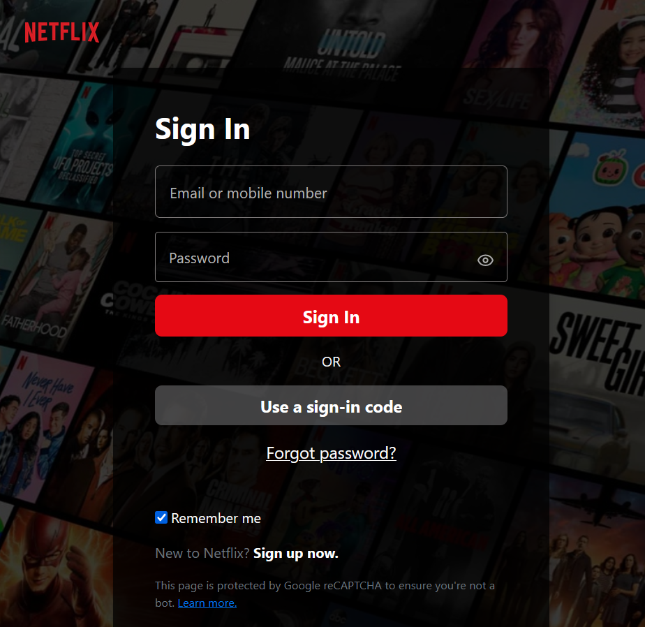
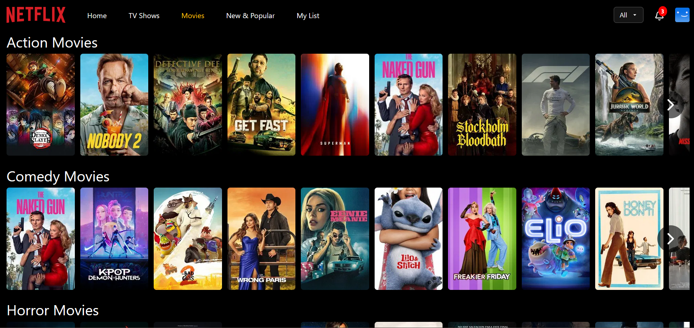
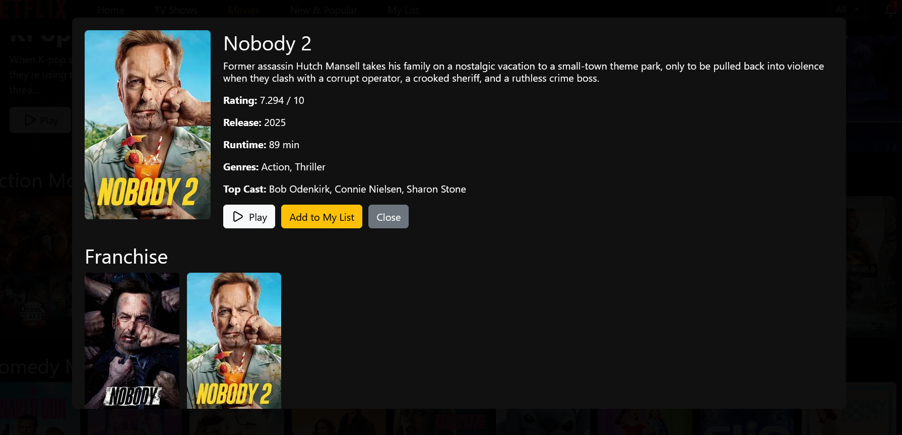

# 🎬 Netflix Clone

A Netflix-inspired streaming web application built with **React (Vite)** and **JSON Server**.  
This project demonstrates user authentication, movie browsing, and responsive UI — built as a portfolio project for learning and showcasing frontend development skills.

---
## 🌐 Live Demo

🔗 **Hosted App:** [Netflix Clone](https://nettflixx-project-7n7789.netlify.app/)  

📧 **Test Login Credentials**  
- **Email:** `admin@gmail.com`  
- **Password:** `admin1234`  

**Or create your own account by signing up**

---

## 📸 Screenshots

### Home Page


### Signin Page


### Dashboard Page


### Movie rows


### Movie info modal


---

## 🚀 Features

- 🔐 **Authentication** – Sign up & log in with JSON Server  
- 🎥 **Browse Movies** – Trending, Popular, Top Rated, etc.  
- 📝 **Movie Details** – Overview, cast, and trailers  
- 📌 **My List** – Add/remove favorite movies
- 🎚️ **Movie Certification Filter** – Toggle movies based on certification (e.g., G, PG, PG-13, R)   
- 📱 **Responsive Design** – Works on desktop & mobile  

---

## 🛠️ Tech Stack

- **Frontend:** React (Vite), custom CSS  
- **State Management:** React Hooks / Context API  
- **Mock Backend:** JSON Server  
- **API:** [TMDB API](https://www.themoviedb.org/) for movies  
- **Icons:** [Lucide-React](https://lucide.dev/)  

---

## 📂 Project Structure

```bash
netflix-clone/
├─ dist/                  # Production build output
├─ node_modules/          # Dependencies
├─ public/                # Public assets
├─ src/
│  ├─ assets/             # Static assets (images, gifs, etc.)
│  ├─ components/         # Reusable UI components
│  ├─ layouts/            # Conditional layout components
│  ├─ locales/            # i18n translations
│  ├─ Pages/              # Application pages (Home, Login, Signup, Player, etc.)
│  ├─ services/           # API calls & Axios config
│  ├─ api.js              # TMDB & backend API setup
│  ├─ App.jsx             # Root component
│  ├─ i18n.js             # Internationalization setup
│  ├─ index.css           # Global styles
│  └─ main.jsx            # Entry point
├─ .env                   # Environment variables (ignored in repo)
├─ .gitignore
├─ db.json                # Mock database for JSON Server
├─ eslint.config.js       # ESLint configuration
├─ index.html             # HTML entry template
├─ package.json
├─ package-lock.json
├─ README.md
└─ vite.config.js         # Vite configuration

